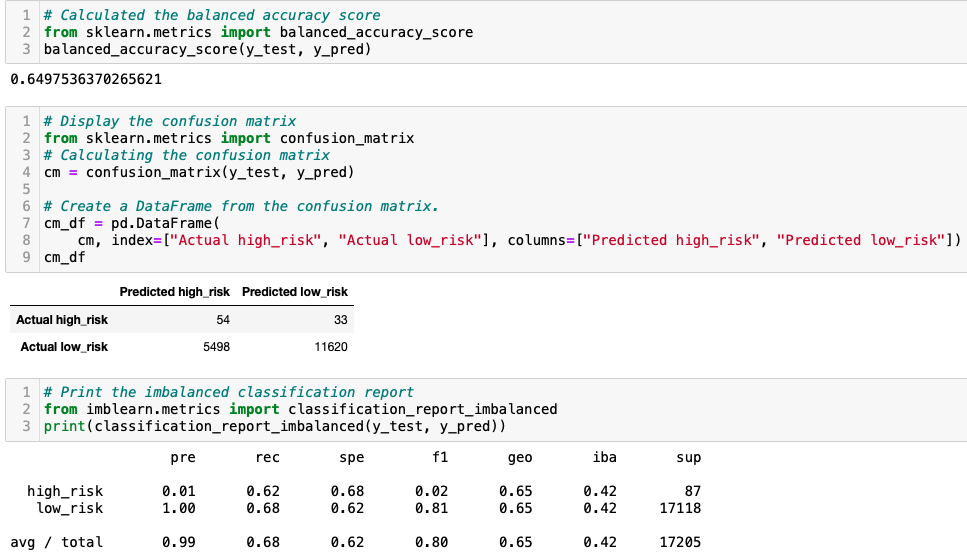

# Credit Risk Analysis

## Overview
In this project, we use Python to build and evaluate several machine learning models to predict credit risk.
The following steps were used:

~Oversample the data using the RandomOverSampler and SMOTE algorithms.
~Undersample the data using the ClusterCentroids algorithm.
~Use a combinatorial approach of over- and undersampling using the SMOTEENN algorithm.
~Compare two machine learning models that reduce bias, BalancedRandomForestClassifier and EasyEnsembleClassifier.
~We will evaluate the performance of these models and make a recommendation on whether they should be used to predict credit risk.

## Results 

### RandomOverSampler Model

### SMOTE Model

### ClusterCentroids model

### SMOTEENN Model

### BalancedRandomForestClassifier Model

### EasyEnsembleClassifier Model

## Summary

